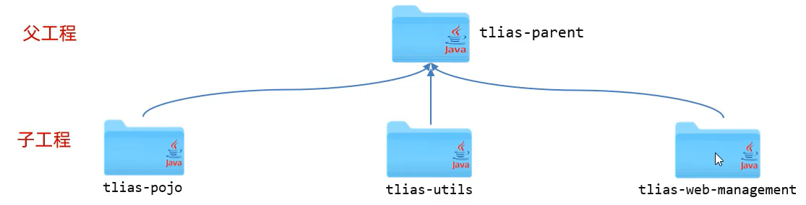

- [1 Maven 高级](#1-maven-高级)
  - [1.1 分模块设计与开发](#11-分模块设计与开发)
    - [1.1.1 分模块开发](#111-分模块开发)
  - [1.2 继承与聚合](#12-继承与聚合)
    - [1.2.1 继承](#121-继承)
      - [继承关系](#继承关系)
      - [版本锁定](#版本锁定)
    - [1.2.2 聚合](#122-聚合)
    - [1.2.3 继承与聚合](#123-继承与聚合)
  - [1.3 私服](#13-私服)
    - [1.3.1 介绍](#131-介绍)
    - [1.3.2 资源上传与下载](#132-资源上传与下载)

# 1 Maven 高级

## 1.1 分模块设计与开发

将项目按照功能拆分成若干个子模块，方便项目的管理维护、扩展，也方便模块间的相互调用，资源共享。


### 1.1.1 分模块开发

- 创建maven模块 tlias-pojo，存放实体类。

- 创建maven模块 tlias-utils，存放相关工具类。
- 注意事项：分模块开发需要先针对模块功能进行设计，再进行编码。不会先将工程开发完毕，然后进行拆分。

## 1.2 继承与聚合

### 1.2.1 继承

#### 继承关系

- 概念：继承描述的是两个工程间的关系，与java中的继承相似，子工程可以继承父工程中的配置信息，常见于依赖关系的继承。

- 作用：简化依赖配置、统一管理依赖

- 实现：`<parent> … </parent>`



1. 打包方式

   - jar：普通模块打包，springboot 项目基本都是jar包（内嵌tomcat运行）

   - war：普通web程序打包，需要部署在外部的tomcat服务器中运行

   - pom：父工程或聚合工程，该模块不写代码，仅进行依赖管理

2. 继承关系实现

   - ① 创建maven模块 tlias-parent ，该工程为父工程，设置打包方式 pom ( 默认 jar )。

   - ② 在子工程的 pom.xml 文件中，配置继承关系。

   - ③ 在父工程中配置各个工程共有的依赖（子工程会自动继承父工程的依赖）。

3. 注意事项

   - 在子工程中，配置了继承关系之后，坐标中的 groupId 是可以省略的，因为会自动继承父工程的 。

   - relativePath 指定父工程的 pom 文件的相对位置（如果不指定，将从本地仓库/远程仓库查找该工程）。
   - 若父子工程都配置了同一个依赖的不同版本，以子工程的为准。

#### 版本锁定

在 maven 中，可以在父工程的 pom 文件中通过 ` <dependencyManagement>  ` 来统一管理依赖版本。仅仅管理依赖版本，不直接依赖

```xml
<dependencyManagement>
    <dependencies>
        <!--JWT令牌-->
        <dependency>
            <groupId>io.jsonwebtoken</groupId>
            <artifactId>jjwt</artifactId>
            <version>0.9.1</version>
        </dependency>
    </dependencies>
</dependencyManagement>
```


- 注意事项：子工程引入依赖时，无需指定  `<version>`  版本号，父工程统一管理。变更依赖版本，只需在父工程中统一变更。

- 自定义属性/引用属性

  

- `<dependencyManagement>` 与 `<dependencies>` 的区别是什么?

  - `<dependencies>`  是直接依赖，在父工程配置了依赖，子工程会直接继承下来。 

  - `<dependencyManagement> ` 是统一管理依赖版本，不会直接依赖，还需要在子工程中引入所需依赖(无需指定版本)

### 1.2.2 聚合

1. 聚合：将多个模块组织成一个整体，同时进行项目的构建。

2. 聚合工程：一个不具有业务功能的“空”工程（有且仅有一个 pom 文件），上面的父工程也可以当作这里的聚合工程

3. 作用：快速构建项目（无需根据依赖关系手动构建，直接在聚合工程上构建即可）

4. maven中可以通过  `<modules>`  设置当前聚合工程所包含的子模块名称

   ```xml
   <!--聚合-->
   <modules>
       <module>../tlias-pojo</module>
       <module>../tlias-utils</module>
       <module>../tlias-web-management</module>
   </modules>
   ```

   - 聚合工程中所包含的模块，在构建时，会自动根据模块间的依赖关系设置构建顺序，与聚合工程中模块的配置书写位置无关。

### 1.2.3 继承与聚合

- 作用

  - 聚合用于快速构建项目

  - 继承用于简化依赖配置、统一管理依赖

- 相同点：

  - 聚合与继承的 pom.xml 文件打包方式均为 pom，可以将两种关系制作到同一个 pom 文件中

  - 聚合与继承均属于设计型模块，并无实际的模块内容

- 不同点：

  - 聚合是在聚合工程中配置关系，聚合可以感知到参与聚合的模块有哪些

  - 继承是在子模块中配置关系，父模块无法感知哪些子模块继承了自己

## 1.3 私服

### 1.3.1 介绍

- 私服是一种特殊的远程仓库，它是架设在局域网内的仓库服务，用来代理位于外部的中央仓库，用于解决团队内部的资源共享与资源同步问题。


- 依赖查找顺序：

  - 本地仓库

  - 私服

  - 中央仓库  

- 注意事项：私服在企业项目开发中，一个项目 / 公司，只需要一台即可（无需我们自己搭建，会使用即可）。

### 1.3.2 资源上传与下载


项目版本：

- RELEASE（发行版本）：功能趋于稳定、当前更新停止，可以用于发行的版本，存储在私服中的 RELEASE 仓库中。

- SNAPSHOT（快照版本）：功能不稳定、尚处于开发中的版本，即快照版本，存储在私服的 SNAPSHOT 仓库中。

1. 设置私服的访问用户名/密码（ settings.xml 中的servers中配置）

   ```xml
   <server>
       <id>maven-releases</id>
       <username>admin</username>
       <password>admin</password>
   </server>
   <server>
       <id>maven-snapshots</id>
       <username>admin</username>
       <password>admin</password>
   </server>
   ```

2. IDEA 的 maven 工程的 pom 文件中配置上传（发布）地址

   ```xml
   <distributionManagement>
       <repository>
           <id>maven-releases</id>
           <url>http://192.168.150.101:8081/repository/maven-releases/</url>
       </repository>
       <snapshotRepository>
           <id>maven-snapshots</id>
           <url>http://192.168.150.101:8081/repository/maven-snapshots/</url>
       </snapshotRepository>
   </distributionManagement>
   
   ```

3. 设置私服依赖下载的仓库组地址（ settings.xml 中的 mirrors、profiles 中配置）

   ```xml
   <mirror>
       <id>maven-public</id>
       <mirrorOf>*</mirrorOf>
       <url>http://192.168.150.101:8081/repository/maven-public/</url>
   </mirror>
   ```