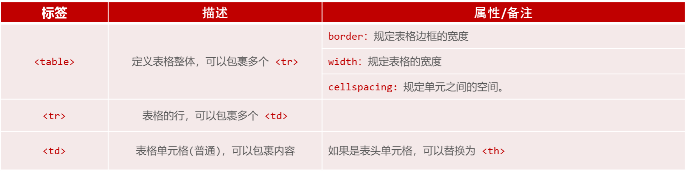
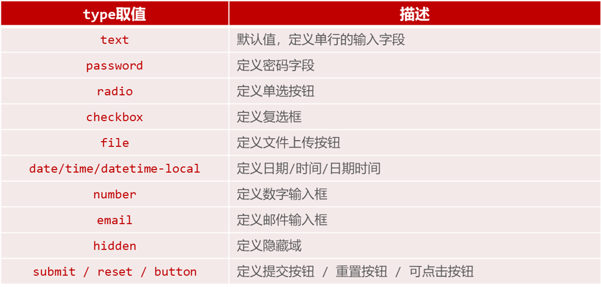
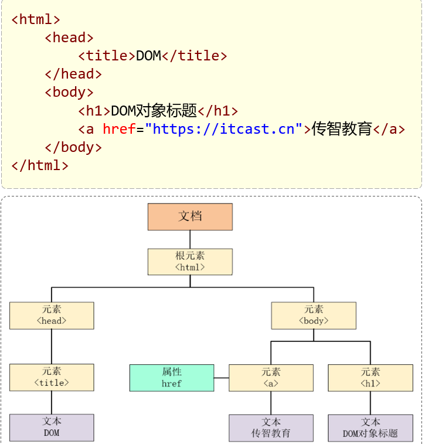
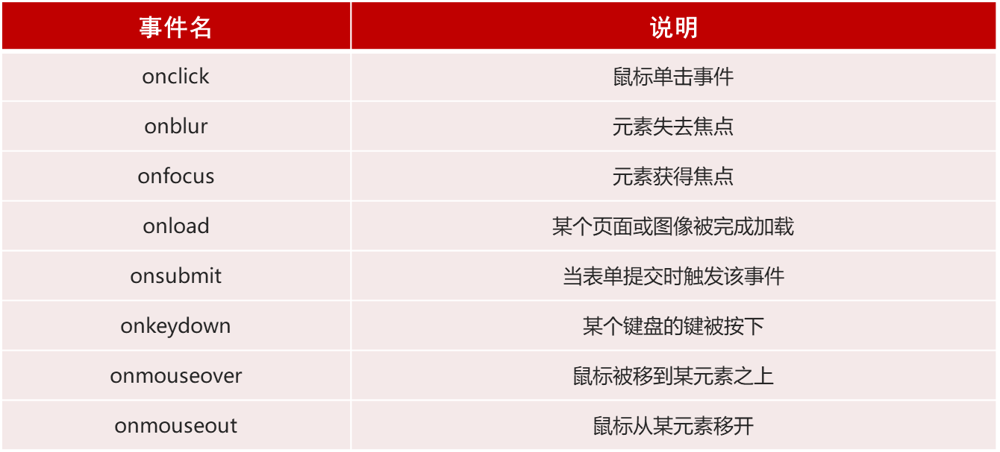

# 前端开发介绍
Web标准也称为网页标准，由一系列的标准组成，大部分由W3C（ World Wide Web
Consortium，万维网联盟）负责制定。由三个组成部分：
- HTML：负责网页的结构（页面元素和内容）。
- CSS：负责网页的表现（页面元素的外观、位置等页面样式，如：颜色、大小等）。
- JavaScript：负责网页的行为（交互效果）。

学习内容：
- HTML & CSS
- JavaScript & Vue
- Ajax & Axios & ElementUI & Nginx
## HTML & CSS
### HTML
HTML: HyperText Markup Language，超文本标记语言。
- 超文本：超越了文本的限制，比普通文本更强大。除了文字信息，还可以定义图片、音频、视频等内容。
- 标记语言：由标签构成的语言。 HTML 标签都是预定义好的。

### CSS
CSS: Cascading Style Sheet，层叠样式表，用于控制页面的样式（表现）。

### HTML快速入门
1. HTML页面的基础结构标签
    ```html
    <html>
        <head>
            <title> </title>
        </head>
        <body>

        </body>
    </html>
    ```
`<title>` 中定义标题显示在浏览器的标题位置，`<body>` 中定义的内容会呈现在浏览器的内容区域。
2. HTML中的标签特点
    - HTML标签不区分大小写
    - HTML标签的属性值，采用单引号、双引号都可以
    - HTML语法相对比较松散 

### 基础标签 & 样式
#### 标题排版
1. 标题标签
    - 标签： `<h1>...<h6>` 重要程度依次降低
2. 水平线标签 `<hr>`
3. 图片标签 ``
    - 绝对路径：绝对磁盘路径（D:/xxxx）、绝对网络路径（https://xxxx）
    - 相对路径：从当前文件开始查找。 （./ : 当前目录, ../ : 上级目录）
#### 标题样式
1. CSS引入方式：
    - 行内样式：写在标签的style属性中（不推荐） `<h1 style="...">`
    - 内嵌样式：写在style标签中（可以写在页面任何位置，但通常约定写在head标签中） `<style> … </style>`
    - 外联样式：写在一个单独的.css文件中（需要通过 link 标签在网页中引入）`xxx.css     <link href="...">`
2. 颜色属性： color: 设置文本内容的颜色
3. ` <span>` 标签
    - <span> 是一个在开发网页时大量会用到的没有语义的布局标签
    - 特点：一行可以显示多个(组合行内元素)，宽度和高度默认由内容撑开
4. CSS选择器
    - 元素选择器：标签名 { … }
    - id选择器：#id属性值 { … }
    - 类选择器：.class属性值 { … }
    - 优先级：id选择器 > 类选择器 > 元素选择器
5. CSS属性
    - color：设置文本的颜色
    - font-size：字体大小 （注意：记得加px）
#### 超链接
1. 标签： `<a href="..." target="...">央视网</a>`
2. 属性：
	- href：指定资源访问的url
	- target：指定在何处打开资源链接
		- _self：默认值，在当前页面打开
		- _blank：在空白页面打开
3. CSS属性
    - text-decoration：规定添加到文本的修饰，none表示定义标准的文本。
    - color：定义文本的颜色

#### 正文排版
1. 视频标签：`<video>`
    - src：规定视频的url
    - controls：显示播放控件
    - width：播放器的宽度
    - height：播放器的高度
2. 音频标签：`<audio>`
    - src：规定音频的url
    - controls：显示播放控件
3. 段落标签：`<p>`
4. 文本加粗标签: `<b> / <strong>`
5. CSS样式
    ```css
    line-height：设置行高
    text-indent：定义第一个行内容的缩进
    text-align：规定元素中的文本的水平对齐方式
    ```
6. 在HTML中无论输入多少个空格，只会显示一个。 可以使用空格占位符：`&nbsp` ;
#### 正文布局
1. 盒子：页面中所有的元素（标签），都可以看做是一个 盒子，由盒子将页面中的元素包含在一个矩形区域内，通过盒子的视角更方便的进行页面布局
2. 盒子模型组成：内容区域（content）、内边距区域（padding）、边框区域（border）、外边距区域（margin）
3. 布局标签：实际开发网页中，会大量频繁的使用 div 和 span 这两个没有语义的布局标签。
4. 标签：`<div>  <span>`
5. 特点：
    - div标签：
        - 一行只显示一个（独占一行）
        - 宽度默认是父元素的宽度，高度默认由内容撑开
        - 可以设置宽高（width、height）
    - span标签：
        - 一行可以显示多个
        - 宽度和高度默认由内容撑开
        - 不可以设置宽高（width、height）
6. CSS盒子模型： 组成：内容（content）、内边距（padding）、边框（border）、外边距（margin）
7. CSS 属性
    ```css  
    width：设置宽度
    height：设置高度
    border：设置边框的属性，如：1px solid #000；
    padding：内边距
    margin：外边距

    注意：如果只需要设置某一个方位的边框、内边距、外边距，可以在属性名后加上 –位置，如：padding-top、padding-left、padding-right …
    ```
#### 表格标签

```css
<table>：定义表格
<tr>：定义表格中的行，一个 <tr> 表示一行
<th>：表示表头单元格，具有加粗居中效果
<td>：表示普通单元格
```
#### 表单标签
1. 场景：在网页中主要负责数据采集功能，如 注册、登录等数据采集。
2. 标签：`<form>`
3. 表单项：不同类型的 input 元素、下拉列表、文本域等。
    ```css
    <input>： 定义表单项，通过type属性控制输入形式
    <select>： 定义下拉列表
    <option> 定义列表项。
    <textarea>： 定义文本域
    ```
4. 属性：
    ```css
    action：规定当提交表单时向何处发送表单数据，URL
    method：规定用于发送表单数据的方式。GET、POST
    ```

    

## JavaScript
### 什么是 JavaScript
1. JavaScript（简称：JS） 是一门跨平台、面向对象的脚本语言。是用来控制网页行为的，它能使网页可交互。
2. JavaScript 和 Java 是完全不同的语言，不论是概念还是设计。但是基础语法类似。
3. JavaScript 在 1995 年由 Brendan Eich 发明，并于 1997 年成为 ECMA 标准。
4. ECMAScript6 (ES6) 是最主流的 JavaScript 版本（发布于 2015 年）。
### JavaScript引入方式
1. 内部脚本：将JS代码定义在HTML页面中
    - JavaScript代码必须位于 `<script></script>` 标签之间
    - 在HTML文档中，可以在任意地方，放置任意数量的`<script>`
    - 一般会把脚本置于 `<body>` 元素的底部，可改善显示速度
    ```javascript
    <script>
            alert("Hello JavaScript")
    </script>
    ```
2. 外部脚本：将 JS代码定义在外部 JS文件中，然后引入到 HTML页面中
    - 外部JS文件中，只包含JS代码，不包含 `<script>` 标签
    - `<script>` 标签不能自闭合
    ```javascript
    <script src="js/demo.js"></script>
    alert("Hello JavaScript")
    ```
### JS基础语法
#### 书写语法
1. 区分大小写：与 Java 一样，变量名、函数名以及其他一切东西都是区分大小写的
2. 每行结尾的分号可有可无
3. 注释：
    - 单行注释：// 注释内容
    - 多行注释：/* 注释内容 */
4. 大括号表示代码块
5. 输出语句
    - 使用 window.alert() 写入警告框
    - 使用 document.write() 写入 HTML 输出
    - 使用 console.log() 写入浏览器控制台
    ```javascript
    <script>
        window.alert("Hello JavaScript"); //浏览器弹出警告框
        document.write("Hello JavaScript"); //写入HTML,在浏览器展示
        console.log("Hello JavaScript"); //写入浏览器控制台
    </script>
    ```
#### 变量
1. JavaScript 中用 var 关键字（variable 的缩写）来声明变量 。
2. JavaScript 是一门弱类型语言，变量可以存放不同类型的值 。
3. 变量名需要遵循如下规则：
    - 组成字符可以是任何字母、数字、下划线（_）或美元符号（$）
    - 数字不能开头
    - 建议使用驼峰命名
4. ECMAScript 6 新增了 let 关键字来定义变量。它的用法类似于 var，但是所声明的变量，只在 let 关键字所在的代码块内有效，且不允许重复声明。
5. ECMAScript 6 新增了 const 关键字，用来声明一个只读的常量。一旦声明，常量的值就不能改变。
6. 特点：
     - var：声明变量，全局作用域/函数作用域，允许重复声明
	 - let：声明变量，块级作用域，不允许重复声明
	 - const：声明常量，一旦声明，常量的值不能改变

#### 数据类型、运算符、流程控制语句
1. 数据类型： JavaScript 中分为：原始类型 和 引用类型
2. 原始类型：
    - number：数字（整数、小数、NaN(Not a Number)）
    - string：字符串，单双引皆可
    - boolean：布尔。true，false
    - null：对象为空，运行类型为 Object
    - undefined：当声明的变量未初始化时，该变量的默认值是 undefined
    - 使用 typeof 运算符可以获取数据类型：
3. 运算符
    - 算术运算符：+ , - , * , / , % , ++ , --
    - 赋值运算符：= , += , -= , *= , /= , %=
    - 比较运算符：> , < , >= , <= , != , == , === 
    - 逻辑运算符：&& , || , !
    - 三元运算符：条件表达式 ? true_value: false_value
4. == 与 ===： == 会进行类型转换，=== 不会进行类型转换
5. 类型转换
    - 字符串类型转为数字：
        - 将字符串字面值转为数字。 如果字面值不是数字，则转为NaN。
    - 其他类型转为 boolean：
        - Number：0 和 NaN为false，其他均转为true。
        - String：空字符串为false，其他均转为true。
        - Null 和 undefined ：均转为false。
6. 流程控制语句
    - if…else if …else…
    - switch
    - for 
    - while
    - do … while

### js 函数
1. 介绍：函数（方法）是被设计为执行特定任务的代码块。
2. 定义：JavaScript 函数通过 function 关键字进行定义，语法为：
    ```javascript
    //定义方式一
    function functionName(参数1,参数2..){
        //要执行的代码
        }
    //定义方式二
    var functionName = function (参数1,参数2..）{
        //要执行的代码
        }
    ```
3. 注意：
    - 形式参数不需要类型。因为JavaScript是弱类型语言
    - 返回值也不需要定义类型，可以在函数内部直接使用return返回即可
    - JS中，函数调用可以传递任意个数的参数
4. 调用：函数名称(实际参数列表)
### js 对象
#### Array
1. JavaScript 中 Array对象用于定义数组。
2. 定义：
    ```javascript
    var 变量名 = new Array(元素列表); //方式一
    var 变量名 = [ 元素列表 ]; //方式二
    ```
3. 访问： `arr[ 索引 ] = 值; `
4. JavaScript 中的数组相当于 Java 中集合，数组的长度是可变的，而 JavaScript 是弱类型，所以可以存储任意的类型的数据。
5. 属性： length、设置或返回数组中元素的数量。
6. 方法：
    - forEach()： 遍历数组中的每个有值的元素，并调用一次传入的函数
    - push()： 将新元素添加到数组的末尾，并返回新的长度。
    - splice()： 从数组中删除元素。
7. 箭头函数(ES6)：是用来简化函数定义语法的。具体形式为:  `(…) => { … } `，如果需要给箭头函数起名字： `var  xxx = (…) => { … }`
#### String
1. String字符串对象创建方式有两种：
    ```javascript
    var 变量名 = new String("…") ; //方式一
    var 变量名 = "…" ; //方式二
    ```
2. 属性： length、 字符串的长度。
3. 方法：
    | 方法 | 描述 |
    | :---: | :---: |
    | charAt() | 返回在指定位置的字符。 |
    | indexOf() | 检索字符串。|
    | trim() | 去除字符串两边的空格 |
    | substring() | 提取字符串中两个指定的索引号之间的字符 |

#### JSON
1. 定义格式
    ```javascript
    var 对象名 = {
        属性名1: 属性值1, 
        属性名2: 属性值2,
        属性名3: 属性值3,
        函数名称: function(形参列表){} // 可以将 :function 省略 
        };
    ```
2. 调用格式：
    ```javascript
    对象名.属性名;
    对象名.函数名();
    ```   
3. 概念：JavaScript Object Notation，JavaScript 对象标记法。 
    - JSON 是通过 JavaScript 对象标记法书写的文本。
    - 由于其语法简单，层次结构鲜明，现多用于作为数据载体，在网络中进行数据传输
    - 外层单引号大括号引起来，key 要双引号
4. 基本语法
    - 定义： `var 变量名 = '{"key1": value1, "key2": value2}';`
    - JSON 字符串转为 JS 对象： `var jsObject = JSON.parse(userStr);`
    - JS 对象转为 JSON 字符串：`var jsonStr = JSON.stringify(jsObject; `
    - value 的数据类型为：
        ```
        数字（整数或浮点数）
        字符串（在双引号中）
        逻辑值（true 或 false）
        数组（在方括号中）
        对象（在花括号中）
        null
        ```
#### BOM
1. 概念： Browser Object Model  浏览器对象模型，允许JavaScript与浏览器对话， JavaScript 将浏览器的各个组成部分封装为对象。
2. 组成：
    - Window：浏览器窗口对象
    - Navigator：浏览器对象
    - Screen：屏幕对象
    - History：历史记录对象
    - Location：地址栏对象
3. Window：
    - 介绍：浏览器窗口对象。
    - 获取：直接使用window，其中 window. 可以省略。 `window.alert("Hello Window"); ` = `alert("Hello Window");`
    - 属性
        - history：对 History 对象的只读引用。
        - location：用于窗口或框架的 Location 对象。
        - navigator：对 Navigator 对象的只读引用。
    - 方法
        - alert()：显示带有一段消息和一个确认按钮的警告框。
        - confirm()：显示带有一段消息以及确认按钮和取消按钮的对话框。 返回 bool 值
        - setInterval()：按照指定的周期（以毫秒计）来调用函数或计算表达式。
        - setTimeout()：在指定的毫秒数后调用函数或计算表达式。
4. Location
    - 介绍：地址栏对象。
    - 获取：使用 window.location 获取，其中 window. 可以省略。 `window.location.属性;  和  location.属性;`
    - 属性：
        - href：设置或返回完整的URL。

#### DOM
1. 概念：Document Object Model ，文档对象模型。
2. 将标记语言的各个组成部分封装为对应的对象：
    - Document：整个文档对象 html
    - Element：元素对象。 每个标签封装为 Element 对象
    - Attribute：属性对象。 标签中的属性被封装为 Attribute 对象
    - Text：文本对象。 标签中的文本被封装为 Text 对象
    - Comment：注释对象。 注释被封装为 注释对象
    
3. JavaScript 通过 DOM，就能够对 HTML 进行操作：
    - 改变 HTML 元素的内容
    - 改变 HTML 元素的样式（CSS）
    - 对 HTML DOM 事件作出反应
    - 添加和删除 HTML 元素
4. DOM是 W3C（万维网联盟）的标准，定义了访问HTML和XML文档的标准，分为3个不同的部分：
    1. Core DOM - 所有文档类型的标准模型
        - Document：整个文档对象
        - Element：元素对象
        - Attribute：属性对象
        - Text：文本对象
        - Comment：注释对象
    2. XML DOM - XML 文档的标准模型  
    3. HTML DOM - HTML 文档的标准模型
        ```javascript
        Image：
        Button ：<input type='button'>
        ```
5. HTML 中的 Element 对象可以通过 Document 对象获取，而 Document 对象是通过 window 对象获取的。 
6. Document 对象中提供了以下获取 Element 元素对象的函数：
    ```javascript
    // 根据id属性值获取，返回单个Element对象
    var h1 = document.getElementById('h1');
    // 根据标签名称获取，返回Element对象数组
    var divs = document.getElementsByTagName('div');
    // 根据name属性值获取，返回Element对象数组
    var hobbys = document.getElementsByName('hobby');
    // 根据class属性值获取，返回Element对象数组
    var clss = document.getElementsByClassName('cls');
    ```

### js 事件监听
#### 事件
1. 事件：HTML事件是发生在HTML元素上的 “事情”。比如：
   - 按钮被点击
   - 鼠标移动到元素上
   - 按下键盘按键
2. 事件监听：JavaScript 可以在事件被侦测到时 执行代码。

#### 事件绑定
```javascript
// 方式一：通过 HTML标签中的事件属性进行绑定
<input type="button" onclick="on()" value="按钮1">
<script>
    function on(){
        alert('我被点击了!');
    }
</script>

// 方式二：通过 DOM 元素属性绑定
<input type="button" id="btn" value="按钮2">
<script>
    document.getElementById('btn').onclick=function(){
        alert('我被点击了!');
    }
</script>
```

#### 常见事件
