## Vue 
### 什么是Vue
1. Vue 是一套前端框架，免除原生 JavaScript 中的 DOM 操作，简化书写。
2. 基于 MVVM(Model-View-ViewModel) 思想，实现数据的双向绑定，将编程的关注点放在数据上。
3. 官网： https://v2.cn.vuejs.org/
4. 框架：是一个半成品软件，是一套可重用的、通用的、软件基础代码模型。基于框架进行开发，更加快捷、更加高效。
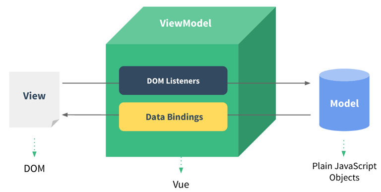
### vue 快速入门
1. 新建HTML页面，引入Vue.js文件
    ```javascript
    <script src="js/vue.js"></script>
    ```
2. 在JS代码区域，创建Vue核心对象，定义数据模型
    ```javascript
    <script>
        new Vue({
            el: "#app",
            data: {
                message: "Hello Vue!"
            }
        })
    </script>
    ```
3. 编写视图
    ```javascript
    <div id="app">
    <input type="text" v-model="message">
        {{ message }}
    </div>
    ```
4. 插值表达式
    - 形式：{{ 表达式 }}。
    - 内容可以是： 变量、三元运算符、函数调用、算术运算
### Vue常用指令
1. 指令：HTML 标签上带有 v- 前缀 的特殊属性，不同指令具有不同含义。例如：v-if，v-for…
2. 常用指令
    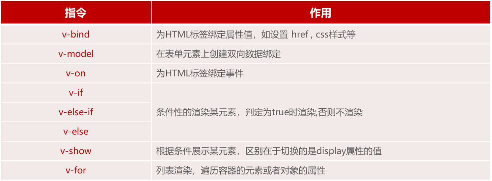
#### v-bind、v-model
```javascript
<script>
  new Vue({
     el: "#app",
     data: {
        url: "https://www.itcast.cn"
     }
  })
</script>
```
- v-bind
    ```javascript
    <a v-bind:href="url">传智教育</a>   // 方式一
    <a :href="url">传智教育</a> // 方式二
    ```
- v-model
    ```javascript
    <input type="text" v-model="url">
    ```
- 通过v-bind或者v-model绑定的变量，必须在数据模型中声明。

#### v-on
    ```javascript
    <input type="button" value="按钮" v-on:click="handle()"> // 方式一
    <input type="button" value="按钮" @click="handle()"> // 方式二

    <script>
        new Vue({
            el: "#app",
            data: {
                //...
            },
            methods: {
                handle:function(){
                    alert('我被点击了');
                }
            },
        })
    </script>
    ```
#### v-if、v-show
- v - if
    ```html
    年龄{{age}},经判定为:
    <span v-if="age <= 35">年轻人</span>
    <span v-else-if="age > 35 && age < 60">中年人</span>
    <span v-else>老年人</span>
    ```
- v - show
    ```html
    年龄{{age}},经判定为:
    <span v-show="age <= 35">年轻人</span>
    ```
#### v - for
```html
<div v-for="addr in addrs">{{addr}}</div>
<div v-for="(addr,index) in addrs">{{index + 1}} : {{addr}}</div>

data: {
   . . .
   addrs: ['北京','上海','广州','深圳','成都','杭州']
},
```
#### 案例
```html
<body>
    <div id="app">   
        <table border="1" cellspacing="0" width="60%">
            <tr>
                <th>编号</th>
                <th>姓名</th>
                <th>年龄</th>
                <th>性别</th>
                <th>成绩</th>
                <th>等级</th>
            </tr>
            <tr align="center">
                <td>1</td>
                <td>Tom</td>
                <td>20</td>
                <td>
                    <span>男</span>
                    <span>女</span>
                </td>
                <td>70</td>
                <td>
                    <span>优秀</span>
                    <span>及格</span>
                    <span style="color: red;">不及格</span>
                </td>
            </tr>
        </table>
    </div>
</body>

<script>
    new Vue({
        el: "#app",
        data: {
            users: [{
                name: "Tom",
                age: 20,
                gender: 1,
                score: 78
            },{
                name: "Rose",
                age: 18,
                gender: 2,
                score: 86
            },{
                name: "Jerry",
                age: 26,
                gender: 1,
                score: 90
            },{
                name: "Tony",
                age: 30,
                gender: 1,
                score: 52
            }]
        },
        methods: {
            
        },
    })
```
### vue 生命周期
- 生命周期：指一个对象从创建到销毁的整个过程。
- 生命周期的八个阶段：每触发一个生命周期事件，会自动执行一个生命周期方法(钩子)。

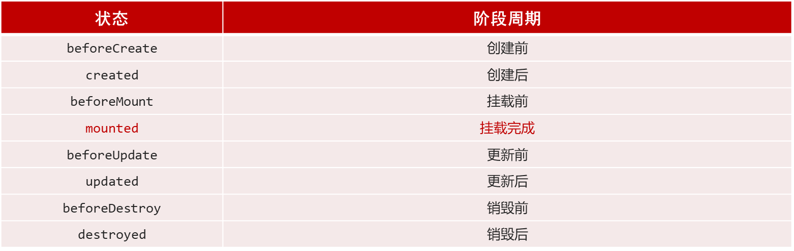

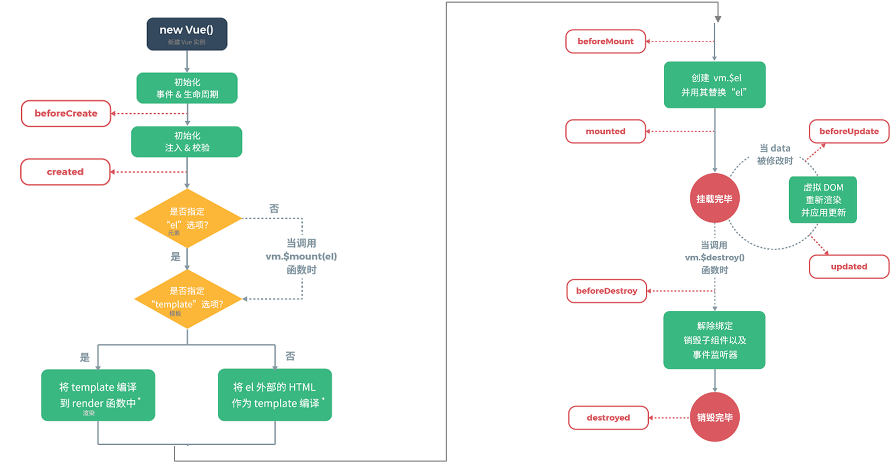

- mounted：挂载完成，Vue初始化成功，HTML页面渲染成功。（发送请求到服务端，加载数据）
    ```javascript
    <script>
        new Vue({
            el: "#app",
            data: {
                
            },
            mounted() {
                console.log("Vue挂载完毕,发送请求获取数据");
            },
            methods: {
               
            },
        })
    </script>

    ```
## Ajax、Vue - Element
### Ajax
1. 概念： Asynchronous JavaScript And XML，异步的JavaScript和XML。
2. 作用：
    - 数据交换：通过 Ajax 可以给服务器发送请求，并获取服务器响应的数据。 
    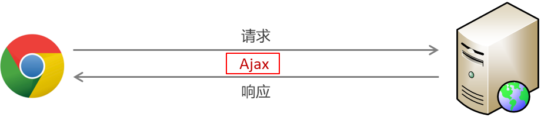

    - 异步交互：可以在不重新加载整个页面的情况下，与服务器交换数据并更新部分网页的技术，如：搜索联想、用户名是否可用的校验等等。
3. 同步和异步
    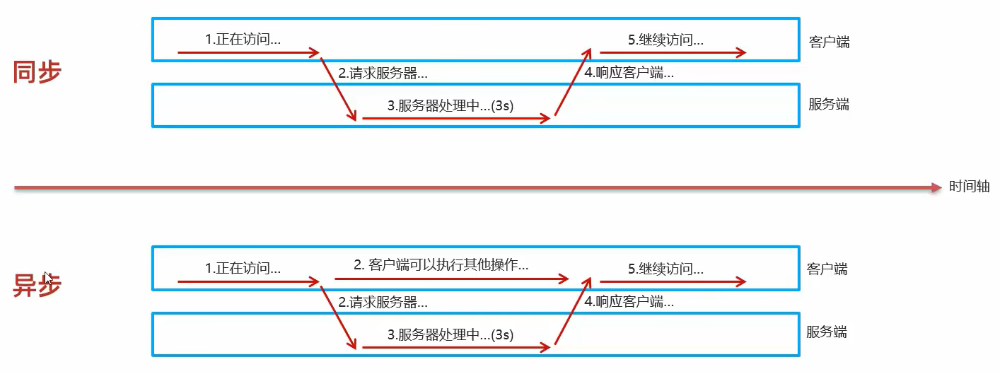
#### 原生 Ajax
- 创建XMLHttpRequest对象：用于和服务器交换数据
- 向服务器发送请求
- 获取服务器响应数据

#### Axios
- 介绍：Axios 对原生的Ajax进行了封装，简化书写，快速开发。
- 官网： https://www.axios-http.cn/

1. Axios 入门
    - 引入Axios的js文件
    ```javascript
    <script src="js/axios-0.18.0.js"></script>
    ```
    - 使用Axios发送请求，并获取响应结果
    ```javascript
    axios({
        method: "get",
        url: "http://yapi.smart-xwork.cn/mock/169327/emp/list"
    }).then((result) => {
        console.log(result.data);
    });

    axios({
        method: "post",
        url: "http://yapi.smart-xwork.cn/mock/169327/emp/deleteById",
        data: "id=1"
    }).then((result) => {
        console.log(result.data);
    });
    ```
2. 请求别名
    - axios.get(url [, config])
    - axios.delete(url [, config])
    - axios.post(url [, data[, config]])
    - axios.put(url [, data[, config]])
    ```javascript
    // 发送 GET 请求
    axios.get("http://yapi.smart-xwork.cn/mock/169327/emp/list").then((result) => {
        console.log(result.data);
    });

    // 发送 POST 请求
    axios.post("http://yapi.smart-xwork.cn/mock/169327/emp/deleteById","id=1").then((result) => {
        console.log(result.data);
    });
    ```
### 前后端分离开发
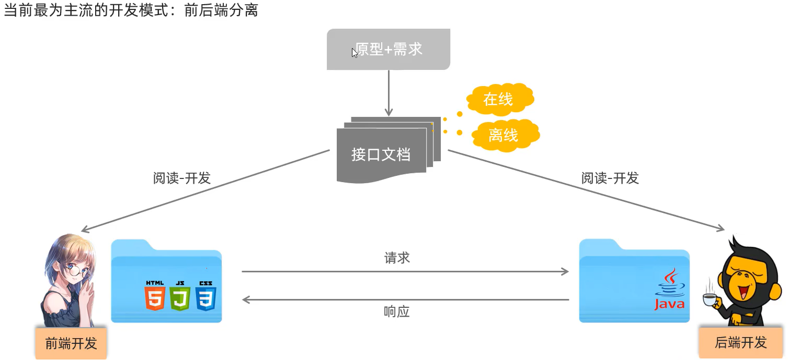


#### YAPI
- 介绍：YApi 是高效、易用、功能强大的 api 管理平台，旨在为开发、产品、测试人员提供更优雅的接口管理服务
- 地址： http://yapi.smart-xwork.cn/
- API接口管理、Mock服务
### 前端工程化
<div align=center>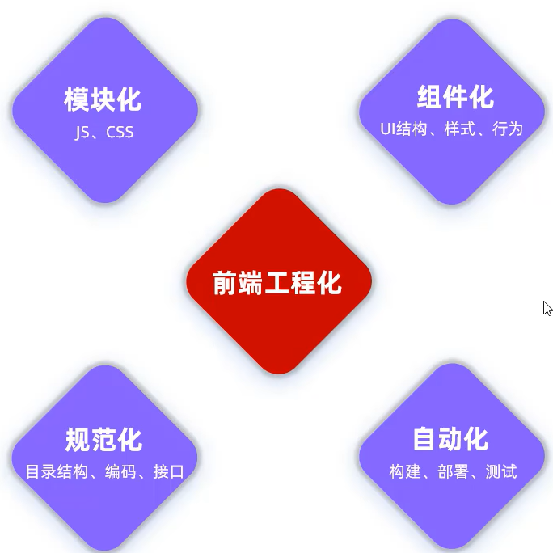</div>

前端工程化：是指在企业级的前端项目开发中，把前端开发所需的工具、技术、流程、经验等进行规范化、标准化。
#### vue - cli
1. 介绍： Vue-cli 是Vue官方提供的一个脚手架，用于快速生成一个 Vue 的项目模板。
2. Vue-cli提供了如下功能：
    - 统一的目录结构
    - 本地调试
    - 热部署
    - 单元测试
    - 集成打包上线
3. 依赖环境：NodeJS 

#### Vue项目-创建
1. 命令行： `npm install -g @vue/cli`
2. 图形化界面： `vue ui`
3. 基于Vue脚手架创建出来的工程，有标准的目录结构，如下：
    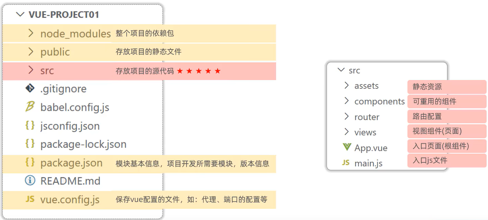
4. Vue 项目 启动
    - 方式一：图形化界面
    - 方式二：命令行 npm run serve
5. 配置端口
    ```javascript
    const { defineConfig } = require('@vue/cli-service')
    module.exports = defineConfig({
      transpileDependencies: true,
      devServer: {
        port: 7000,
      }
    })
    ```
#### Vue项目开发流程
- Vue的组件文件以 .vue结尾，每个组件由三个部分组成：`<template> 、<script>、<style> `。
- `<template>` : 模板部分，由它生成HTML代码
- `<script>` : 控制模板的数据来源和行为
- `<style>` : css样式部分
### Vue 组件库 Element
#### 什么是 Element
- Element ：是饿了么团队研发的，一套为开发者、设计师和产品经理准备的基于 Vue 2.0 的桌面端组件库。
- 组件：组成网页的部件，例如 超链接、按钮、图片、表格、表单、分页条等等。
- 官网： https://element.eleme.cn/#/zh-CNListener
#### 快速入门
1. 安装ElementUI组件库 （在当前工程的目录下），在命令行执行指令： `npm install element-ui@2.15.3 `
2. 引入ElementUI组件库
    ```javascript
    import ElementUI from 'element-ui';
    import 'element-ui/lib/theme-chalk/index.css';
    Vue.use(ElementUI);
    ```
3. 访问官网，复制组件代码，调整 

#### 常见组件
1. Table 表格：用于展示多条结构类似的数据，可对数据进行排序、筛选、对比或其他自定义操作。
2. Pagination 分页：当数据量过多时，使用分页分解数据。
3. Dialog 对话框：在保留当前页面状态的情况下，告知用户并承载相关操作。
4. Form 表单：由输入框、选择器、单选框、多选框等控件组成，用以收集、校验、提交数据。
5. Vue项目中使用Axios:
    - 在项目目录下安装axios：npm  install axios;
    - 需要使用axios时，导入axios：import axios from 'axios';
### Vue 路由
前端路由: URL中的hash(#号) 与组件之间的对应关系。
#### Vue Router
1. 介绍： Vue Router 是 Vue 的官方路由。
2. 组成：
    - VueRouter：路由器类，根据路由请求在路由视图中动态渲染选中的组件
    - `<router-link>`： 请求链接组件，浏览器会解析成   `<a>`
    - `<router-view>`：动态视图组件，用来渲染展示与路由路径对应的组件
    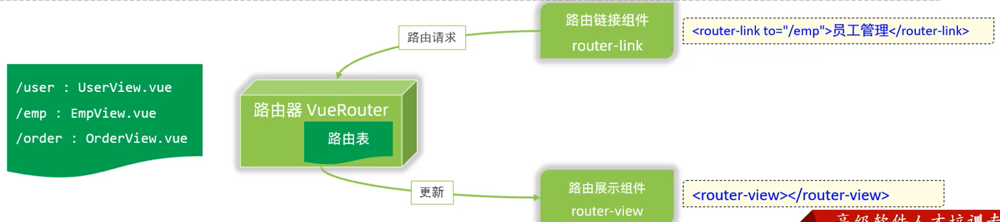
3. 安装(创建Vue项目时已选择) `npm install vue-router@3.5.1 `
    ```javascript
    <router-link to="/dept">部门管理</router-link>
    <router-link to="/emp">员工管理</router-link>
    <router-view></router-view>
    ```
### 打包 - 部署
#### 打包
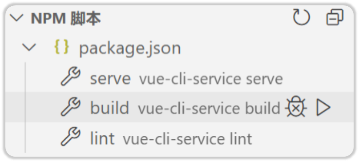
#### 部署
- 介绍：Nginx是一款轻量级的Web服务器/反向代理服务器及电子邮件（IMAP/POP3）代理服务器。其特点是占有内存少，并发能力强，在各大型互联网公司都有非常广泛的使用。
- 官网：https://nginx.org/
- 部署：将打包好的 dist 目录下的文件，复制到nginx安装目录的html目录下。
- 启动：双击 nginx.exe 文件即可，Nginx服务器默认占用 80 端口号
<div align=center>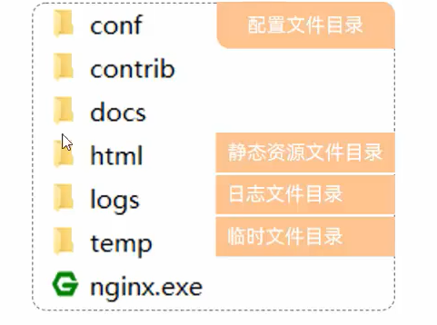</div>

- Nginx默认占用80端口号，如果80端口号被占用，可以在nginx.conf中修改端口号。(netstat –ano | findStr  80)