# 第3 章 请求响应
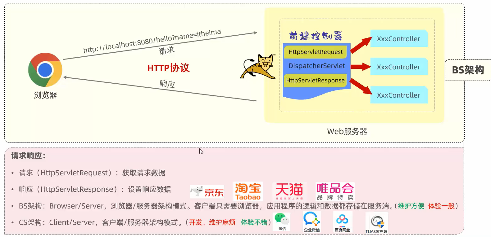
## 请求
### Postman
- Postman是一款功能强大的网页调试与发送网页HTTP请求的Chrome插件。
- 作用：常用于进行接口测试
### 简单参数
1. 原始方式： 在原始的web程序中，获取请求参数，需要通过 HttpServletRequest 对象手动获取。
2. SpringBoot 方式： 简单参数：参数名与形参变量名相同，定义形参即可接收参数。会自动进行类型转换
    ```java
    @RequestMapping("/simpleParam")
    public String simpleParam(String name , Integer age){    
        System.out.println(name+"  :  "+age);    
        return "OK";
        }

    ```
3. 简单参数：如果方法形参名称与请求参数名称不匹配，可以使用 `@RequestParam` 完成映射。
    ```java
    @RequestMapping("/simpleParam")
    public String simpleParam(@RequestParam(name = "name") String username , Integer age){
        System.out.println(username + " : " + age);
        return "OK";
        }

    ```
    -  @RequestParam 中的 required 属性默认为true ，代表该请求参数必须传递，如果不传递将报错。 如果该参数是可选的，可以将 required 属性设置为 false。
### 实体参数
#### 简单实体对象
请求参数名与形参对象属性名相同，定义POJO接收即可
```java
public class User {    
    private String name;   
    private Integer age;
}
@RequestMapping("/simplePojo")
public String simplePojo(User user){    
    System.out.println(user);
    return "OK";
    }
```
#### 复杂实体对象
请求参数名与形参对象属性名相同，按照对象层次结构关系即可接收嵌套POJO属性参数。
```java
public class Address {
    private String province;
    private String city;
}

public class User {    
    private String name;   
    private Integer age;
    private Address address;
}
@RequestMapping("/simplePojo")
public String simplePojo(User user){    
    System.out.println(user);
    return "OK";
    }
```
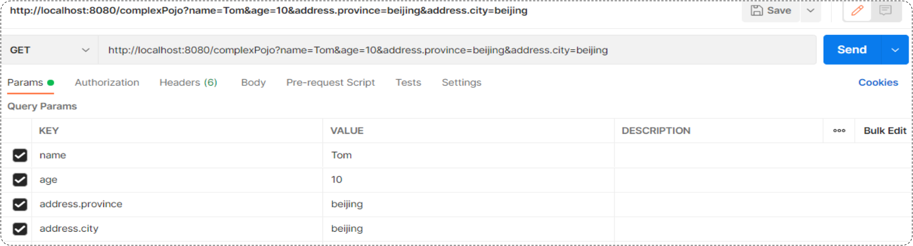
### 数组集合参数
#### 数组参数
请求参数名与形参数组名称相同且请求参数为多个，直接使用数组类型形参接收参数。
```java
@RequestMapping("/arrayParam")
public String arrayParam(String[] hobby){
    System.out.println(Arrays.toString(hobby));
    return "OK";
    }
```
#### 集合参数
请求参数名与形参集合名称相同且请求参数为多个，通过 `@RequestParam` 绑定参数关系
```java
@RequestMapping("/listParam")
public String listParam(@RequestParam List<String> hobby){
    System.out.println(hobby);
    return "OK";
    }

```
### 日期参数
日期参数：使用 `@DateTimeFormat` 注解完成日期参数格式转换 
```java
@RequestMapping("/dateParam")
public String dateParam(@DateTimeFormat(pattern = "yyyy-MM-dd HH:mm:ss") LocalDateTime updateTime){
    System.out.println(updateTime);
    return "OK";
    }
```
### Json参数
JSON 参数：JSON 数据键名与形参对象属性名相同，定义 POJO 类型形参即可接收参数，需要使用 `@RequestBody` 标识。
### 路径参数
路径参数：通过请求 URL 直接传递参数，使用 {…} 来标识该路径参数，需要使用 `@PathVariable` 获取路径参数
```java
@RequestMapping("/path/{id}/{name}")
public String pathParam2(@PathVariable Integer id, @PathVariable String name){
    System.out.println(id+ " : " +name);
    return "OK";
    }
```
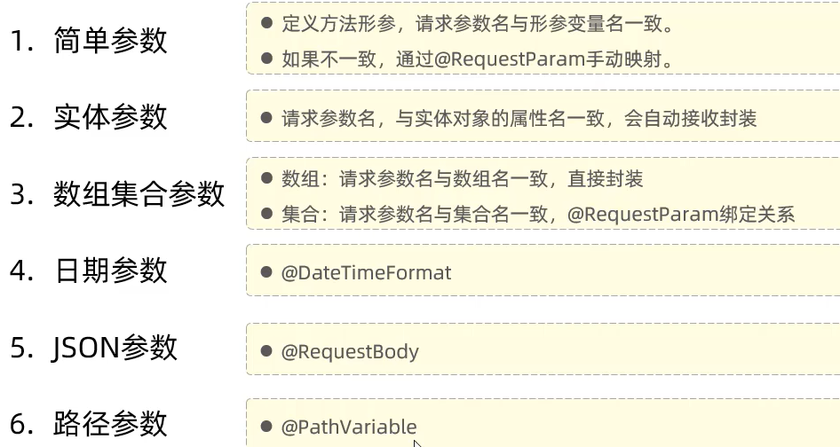
## 响应
@ResponseBody
- 类型：方法注解、类注解
- 位置：Controller 方法上/类上
- 作用：将方法返回值直接响应，如果返回值类型是 实体对象 / 集合 ，将会转换为 JSON 格式响应
- 说明：`@RestController = @Controller + @ResponseBody`;
- 不便管理，需要统一响应结果，Result（code、msg、data）
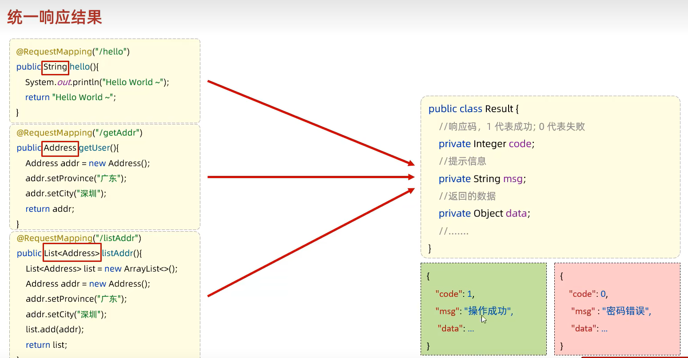
### 案例
Springboot 项目的静态资源(html，css，js等前端资源)默认存放目录为：`classpath:/static 、 classpath:/public、 classpath:/resources`

## 分层解耦
### 三层架构
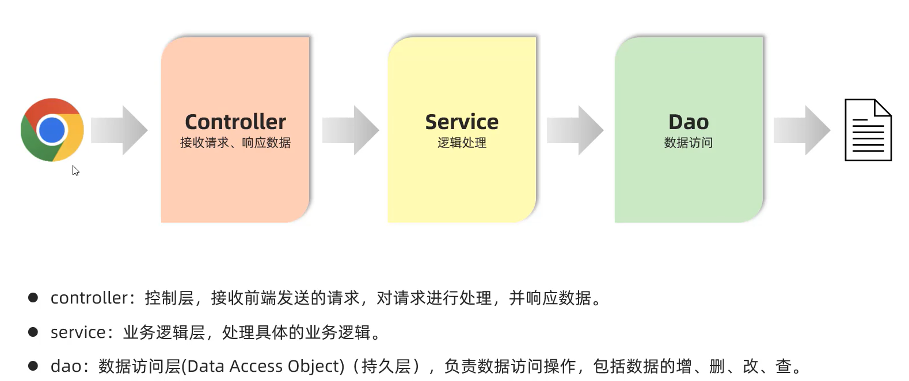
- 复用性差、难以维护 VS 复用性强、便于维护、利于拓展
### 分层解耦
- 内聚：软件中各个功能模块内部的功能联系。
- 耦合：衡量软件中各个层/模块之间的依赖、关联的程度。
- 软件设计原则：高内聚低耦合。
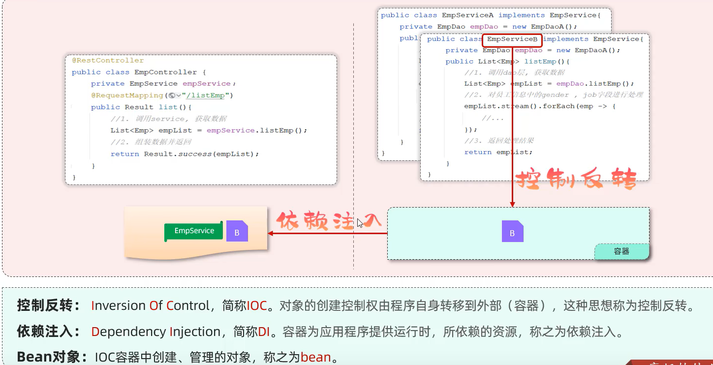
### IOC & DI入门
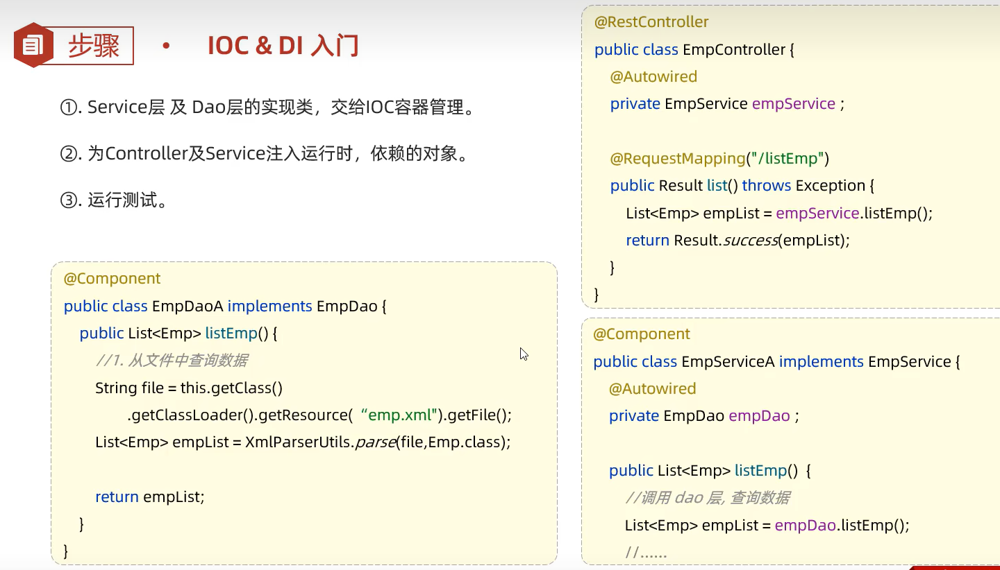
- `@Component` 将当前类交给 IOC 容器管理，成为 IOC 容器中的 bean
- `@Autowired` 运行时，IOC 容器会提供该类型的 bean 对象，并赋值给该变量，依赖注入
### IOC详解
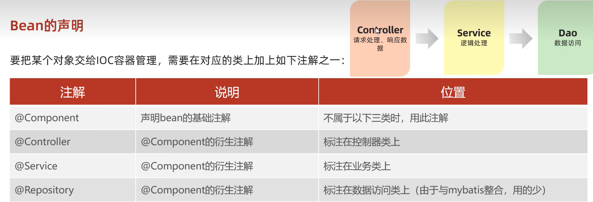

注意事项：

- 声明 bean 的时候，可以通过 value 属性指定 bean 的名字，如果没有指定，默认为类名首字母小写。
- 使用以上四个注解都可以声明 bean ，但是在 springboot 集成 web 开发中，声明控制器 bean 只能用 @Controller。
#### 组件扫描
- 前面声明 bean 的四大注解，要想生效，还需要被组件扫描注解 `@ComponentScan` 扫描。
- `@ComponentScan` 注解虽然没有显式配置，但是实际上已经包含在了启动类声明注解 。 `@SpringBootApplication` 中，默认扫描的范围是启动类所在包及其子包。


### DI详解
1. `@Autowired` 注解，默认是按照类型进行，如果存在多个相同类型的 bean ，将会报出错误。
2. 通过以下几种方案来解决：
    - `@Primary`
    ```java
    @Primary // 定义在 service 层
    @Service
    public class EmpServiceA implements EmpService {
    }
    ```
    - `@Autowired + @Qualifier("bean的名称")`
    ```java
    @RestController
    public class EmpController {
        @Autowired   
        @Qualifier("empServiceA") // 定义在 Controller 层
        private EmpService empService ;
    }
    ```
    - `@Resource(name="bean的名称")`
    ```java
    @RestController
    public class EmpController {
        @Resource(name = "empServiceB") //  定义在 Controller 层  
        private EmpService empService ;
    ```
3. `@Resource` 与 `@Autowired` 区别
    - `@Autowired` 是 spring 框架提供的注解，而`@Resource` 是 JDK 提供的注解。
    - `@Autowired` 默认是按照类型注入，而`@Resource` 默认是按照名称注入。

# 第 4 章 MySQL
## 数据库
1. 数据库：DataBase（DB），是存储和管理数据的仓库。
2. 数据库管理系统：DataBase Management System  (DBMS)，操纵和管理数据库的大型软件。
3. SQL：Structured Query Language，操作关系型数据库的编程语言，定义了一套操作关系型数据库统一标准。
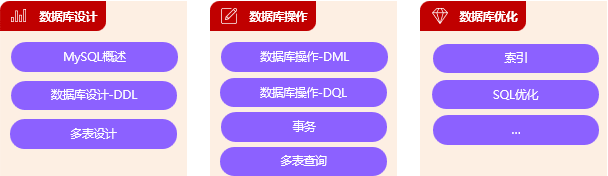
## MySQL概述
1. 数据模型：关系型数据库（RDBMS）: 建立在关系模型基础上，由多张相互连接的二维表组成的数据库。
2. SQL: 一门操作关系型数据库的编程语言，定义操作所有关系型数据库的统一标准。
    - SQL语句可以单行或多行书写，以分号结尾。
    - SQL语句可以使用空格/缩进来增强语句的可读性。
    - MySQL数据库的SQL语句不区分大小写。
    - 注释：
        - 单行注释：-- 注释内容 或 # 注释内容(MySQL特有)
        - 多行注释： /* 注释内容 */
3. SQL 分类
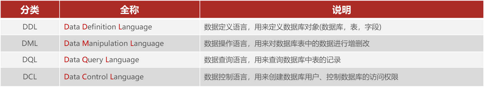

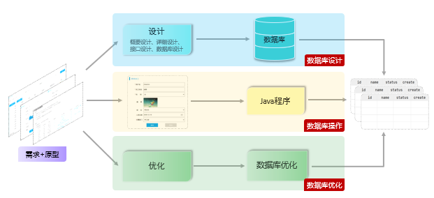
## 数据库设计-DDL
DDL 英文全称是 Data Definition Language，数据定义语言，用来定义数据库对象(数据库、表)。
### DDL（数据库操作）
1. 查询：
    - 查询所有数据库：show databases;
    - 查询当前数据库：select database();
2. 使用：
    - 使用数据库：use  数据库名 ;
3. 创建
    - 创建数据库： create  database [ if  not  exists ]   数据库名 ;
4. 删除:
    - 删除数据库：drop  database [ if exists ]   数据库名 ;
5. 上述语法中的database，也可以替换成 schema。如：create schema  db01;
### 表（创建、查询、修改、删除）
1. 创建
    ```sql
    create table  表名(
        字段1  字段类型  [ 约束 ]  [ comment  字段1注释 ] ,
        ......
        字段n  字段类型  [ 约束 ]  [ comment  字段n注释 ] 
    ) [ comment  表注释 ] ;
    ```
2. 约束
    - 概念：约束是作用于表中字段上的规则，用于限制存储在表中的数据。
    - 目的：保证数据库中数据的正确性、有效性和完整性。

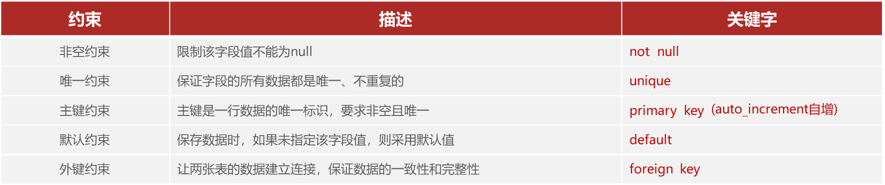
1. 数据类型 : MySQL 中的数据类型有很多，主要分为三类：数值类型、字符串类型、日期时间类型。
2. create_time：记录的是当前这条数据插入的时间。 update_time：记录当前这条数据最后更新的时间。
3. 查询
    - 查询当前数据库所有表：`show tables`;
    - 查询表结构：`desc  表名`;
    - 查询建表语句：`show create table 表名`;
4. 修改
    - 添加字段：`alter table 表名  add  字段名  类型(长度)  [comment  注释]  [约束]`;
    - 修改字段类型：`alter table 表名 modify  字段名  新数据类型(长度)`;
    - 修改字段名和字段类型：`alter table 表名 change  旧字段名  新字段名  类型 (长度)  [comment 注释]  [约束]`;
    - 删除字段：`alter table 表名 drop  column 字段名`;
    - 修改表名： `rename table 表名 to  新表名`;
5. 删除
    - 删除表：`drop table [ if exists ] 表名`;
    - 在删除表时，表中的全部数据也会被删除。
## 数据库操作-DML
DML 英文全称是 Data Manipulation Language (数据操作语言)，用来对数据库中表的数据记录进行增、删、改操作。
### 添加数据（INSERT）
- 指定字段添加数据：`insert into 表名 (字段名1, 字段名2)  values (值1, 值2)`;
- 全部字段添加数据：`insert into 表名 values (值1, 值2, ...)`;
- 批量添加数据（指定字段）：`insert into 表名 (字段名1, 字段名2)  values (值1, 值2), (值1, 值2)`;
- 批量添加数据（全部字段）：`insert into 表名 values (值1, 值2, ...), (值1, 值2, ...)`;

注意事项：
1. 插入数据时，指定的字段顺序需要与值的顺序是一一对应的。
2. 字符串和日期型数据应该包含在引号中。
3. 插入的数据大小，应该在字段的规定范围内。
### 修改数据（UPDATE）
- 修改数据：`update  表名  set  字段名1 = 值1 , 字段名2 = 值2 , .... [ where  条件 ] `;

注意事项：
- 修改语句的条件可以有，也可以没有，如果没有条件，则会修改整张表的所有数据。
### 删除数据（DELETE）
- 删除数据：`delete  from  表名  [ where  条件 ]`;

注意事项：
- DELETE 语句的条件可以有，也可以没有，如果没有条件，则会删除整张表的所有数据。
- DELETE 语句不能删除某一个字段的值 ( 如果要操作，可以使用 UPDATE，将该字段的值置为 NULL )。

## 数据库操作-DQL
- DQL 英文全称是 Data Query Language (数据查询语言)，用来查询数据库表中的记录。
- 关键字：SELECT
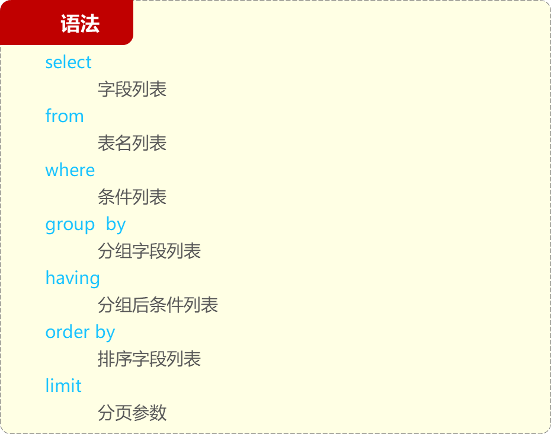
### 基本查询
语法：
- 查询多个字段：`select  字段1, 字段2, 字段3  from   表名`;
- 查询所有字段（通配符）：`select  *  from   表名`;
- 设置别名：`select  字段1  [ as  别名1 ] , 字段2  [ as  别名2 ]   from   表名`;
- 去除重复记录：`select  distinct  字段列表  from   表名`;

注意事项：
- \* 号代表查询所有字段，在实际开发中尽量少用（不直观、影响效率）。
### 条件查询（where）
条件查询：`select  字段列表  from   表名   where   条件列表`;
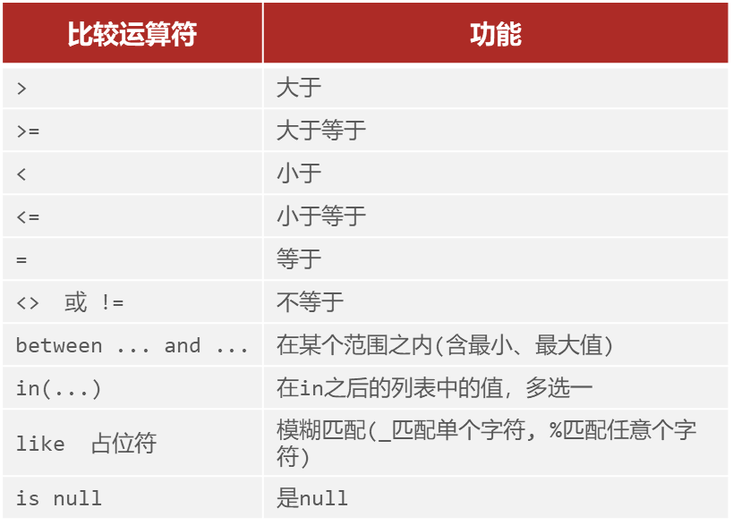
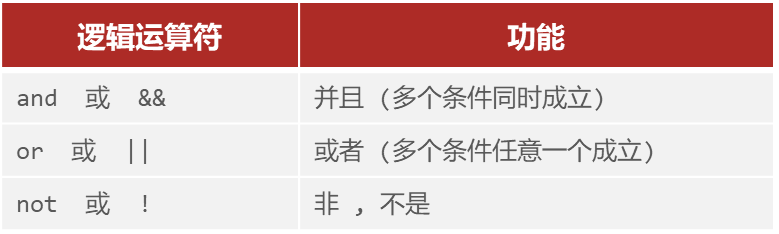
### 分组查询（group by）
#### 聚合函数
- 介绍：将一列数据作为一个整体，进行纵向计算。
- 语法：`select  聚合函数(字段列表)  from   表名` ;
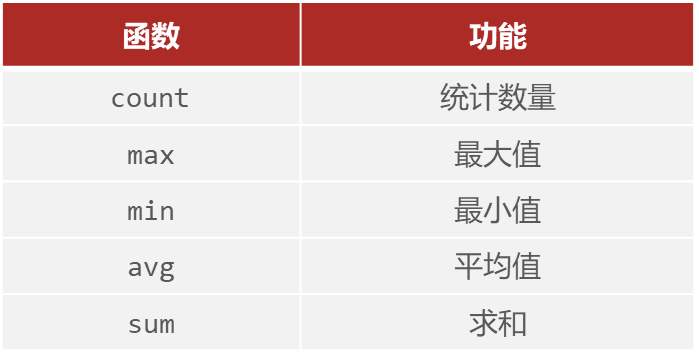

注意事项：
- null 值不参与所有聚合函数运算。
- 统计数量可以使用：count(*)   count(字段)   count(常量)，推荐使用 count(*)。
#### 语法
分组查询： `select  字段列表  from   表名  [ where   条件 ]  group   by  分组字段名  [ having  分组后过滤条件 ];`
- where与having区别
    - 执行时机不同：where 是分组之前进行过滤，不满足 where 条件，不参与分组；而 having 是分组之后对结果进行过滤。
    - 判断条件不同：where 不能对聚合函数进行判断，而 having 可以。
- 注意事项
    - 分组之后，查询的字段一般为聚合函数和分组字段，查询其他字段无任何意义。
    - 执行顺序: `where  >  聚合函数 > having `。

### 排序查询（order by）
1. 语法
条件查询：`select  字段列表  from   表名   [ where   条件列表 ] [ group by  分组字段 ] order  by  字段1  排序方式1 , 字段2  排序方式2 … ;`
2. 排序方式：
    - ASC：升序（默认值）
    - DESC：降序
3. 注意事项
    - 如果是多字段排序，当第一个字段值相同时，才会根据第二个字段进行排序。

### 分页查询（limit）
1. 语法：分页查询：`select  字段列表  from   表名  limit  起始索引, 查询记录数 ;`
2. 注意事项
     - 起始索引从0开始，起始索引 = （查询页码 - 1）* 每页显示记录数。
     - 分页查询是数据库的方言，不同的数据库有不同的实现，MySQL 中是 LIMIT。
     - 如果查询的是第一页数据，起始索引可以省略，直接简写为 limit 10。

## 多表设计
### 概述
项目开发中，在进行数据库表结构设计时，会根据业务需求及业务模块之间的关系，分析并设计表结构，由于业务之间相互关联，所以各个表结构之间也存在着各种联系，基本上分为三种：
- 一对多(多对一)
- 多对多
- 一对一
### 一对多
- 在数据库表中多的一方，添加字段，来关联另外一方的主键。
#### 外键语法
```sql
-- 创建表时指定
create table 表名(
	字段名    数据类型,
	...
	[constraint]   [外键名称]  foreign  key (外键字段名)   references   主表 (字段名)	
);
-- 建完表后，添加外键
alter table  表名  add constraint  外键名称  foreign key (外键字段名) references  主表(字段名);
```
1. 物理外键：
    - 概念： 使用 foreign key 定义外键关联另外一张表。
    - 缺点：
        - 影响增、删、改的效率（需要检查外键关系）。
        - 仅用于单节点数据库，不适用与分布式、集群场景。
        - 容易引发数据库的死锁问题，消耗性能。
2. 逻辑外键（推荐）
    - 概念：在业务层逻辑中，解决外键关联。
    - 通过逻辑外键，就可以很方便的解决上述问题
### 一对一
关系: 一对一关系，多用于单表拆分，将一张表的基础字段放在一张表中，其他字段放在另一张表中，以提升操作效率。 任意一方，添加外键，关联另外一方的主键。

### 多对多
关系: 一个学生可以选修多门课程，一门课程也可以供多个学生选择。 通过中间表来维护，中间表的两个外键，分别关联另外两张表的主键。

## 多表查询
### 概述
- 多表查询: 指从多张表中查询数据
- 笛卡尔积: 笛卡尔乘积是指在数学中，两个集合(A 集合 和 B 集合)的所有组合情况。(在多表查询时，需要消除无效的笛卡尔积)
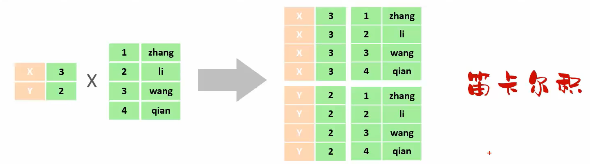

## 事务

## 索引