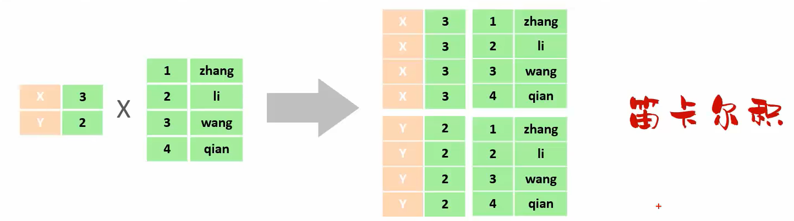

## 多表查询
### 概述
- 多表查询: 指从多张表中查询数据
- 笛卡尔积: 笛卡尔乘积是指在数学中，两个集合(A 集合 和 B 集合)的所有组合情况。(在多表查询时，需要消除无效的笛卡尔积)

#### 分类
1. 连接查询
    - 内连接：相当于查询 A、B 交集部分数据
    - 外连接
        - 左外连接：查询左表所有数据(包括两张表交集部分数据)
        - 右外连接：查询右表所有数据(包括两张表交集部分数据)
2. 子查询
#### 内连接
语法：
- 隐式内连接：`select  字段列表   from   表1 , 表2   where   条件 ... `;
- 显式内连接：`select  字段列表   from   表1  [ inner ]  join 表2  on  连接条件 ... `;

#### 外连接
语法：
- 左外连接：`select  字段列表   from   表1  left  [ outer ]  join 表2  on 连接条件 ... ;`
- 右外连接：`select  字段列表   from   表1  right  [ outer ]  join 表2  on  连接条件 ... ;`

#### 子查询
1. 概述
    - 介绍：SQL 语句中嵌套 select 语句，称为嵌套查询，又称子查询。
    - 形式：`select  *  from   t1   where  column1 =  ( select  column1  from  t2  … );`
    - 子查询外部的语句可以是 `insert / update / delete / select` 的任何一个，最常见的是 `select`。
2. 分类
    - 标量子查询：子查询返回的结果为单个值
    - 列子查询：子查询返回的结果为一列
    - 行子查询：子查询返回的结果为一行
    - 表子查询：子查询返回的结果为多行多列
3. 标量子查询
    - 子查询返回的结果是单个值（数字、字符串、日期等），最简单的形式
    - 常用的操作符：=   <>    >     >=     <    <=      
4. 列子查询
    - 子查询返回的结果是一列（可以是多行）
    - 常用的操作符：`in  、not in` 等
5. 行子查询
    - 子查询返回的结果是一行（可以是多列）。
    - 常用的操作符：`=  、<> 、in 、not  in`
6. 表子查询
    - 子查询返回的结果是多行多列，常作为临时表
    - 常用的操作符：`in`
## 事务
### 介绍 & 操作
1. 概念：事务 是一组操作的集合，它是一个不可分割的工作单位。事务会把所有的操作作为一个整体一起向系统提交或撤销操作请求，即这些操作 要么同时成功，要么同时失败。
2. 注意事项： 默认 MySQL 的事务是自动提交的，也就是说，当执行一条 DML 语句，MySQL 会立即隐式的提交事务。
3. 操作
    - 开启事务：`start transaction;  /  begin ;`
    - 提交事务：`commit;`
    - 回滚事务：`rollback;`

### 四大特性
四大特性(ACID)
- 原子性（Atomicity）：事务是不可分割的最小单元，要么全部成功，要么全部失败
- 一致性（Consistency）：事务完成时，必须使所有的数据都保持一致状态
- 隔离性（Isolation）：数据库系统提供的隔离机制，保证事务在不受外部并发操作影响的独立环境下运行
- 持久性（Durability）：事务一旦提交或回滚，它对数据库中的数据的改变就是永久的

## 索引
### 介绍
索引（index）是帮助数据库 高效获取数据 的 数据结构 。

**优缺点：**
- 优点
    - 提高数据查询的效率，降低数据库的 IO 成本。
    - 通过索引列对数据进行排序，降低数据排序的成本，降低 CPU 消耗。
- 缺点
    - 索引会占用存储空间。
    - 索引大大提高了查询效率，同时却也降低了 `insert、update、delete` 的效率。
### 结构
MySQL 数据库支持的索引结构有很多，如：Hash 索引、B+Tree 索引、Full-Text 索引等。我们平常所说的索引，如果没有特别指明，都是指默认的 B+Tree 结构组织的索引。
- 大数据量情况下，二叉树、红黑树层级深，检索速度慢。

### 语法
- 创建索引：`create  [ unique ]  index 索引名 on  表名 (字段名,... ) ;`
- 查看索引：` show  index  from  表名;`
- 删除索引：` drop  index  索引名  on  表名;`
- 注意事项：
    - 主键字段，在建表时，会自动创建主键索引。
    - 添加唯一约束时，数据库实际上会添加唯一索引。

# 第 5 章 MyBatis
- MyBatis是一款优秀的 持久层(dao 层) 框架，用于简化 JDBC 的开发。
- MyBatis 本是 Apache 的一个开源项目 iBatis, 2010 年这个项目由 apache 迁移到了 google code，并且改名为 MyBatis 。2013 年 11 月迁移到 Github。
- 官网：https://mybatis.org/mybatis-3/zh/index.html 
## Mybatis入门
### 快速入门
1. 准备工作(创建 springboot 工程、数据库表 user、实体类User)
2. 引入 Mybatis 的相关依赖，配置 Mybatis (数据库连接信息)
3. 编写SQL语句(注解/XML)
4. `application.properties` 
    ```java
    spring.datasource.driver-class-name=com.mysql.cj.jdbc.Driver
    spring.datasource.url=jdbc:mysql://localhost:3306/mybatis
    spring.datasource.username=root
    spring.datasource.password=hsp
    ```
    ```java
    @Mapper
    public interface UserMapper {
        @Select("select *  from user")
        public List<User> list();
        }
    ```
### JDBC介绍
- JDBC： ( Java DataBase Connectivity )，就是使用Java语言操作关系型数据库的一套API。

#### 本质
- sun 公司官方定义的一套操作所有关系型数据库的规范，即接口。
- 各个数据库厂商去实现这套接口，提供数据库驱动 jar 包。
- 我们可以使用这套接口（JDBC）编程，真正执行的代码是驱动 jar 包中的实现类。

### 数据库连接池
1. 数据库连接池是个容器，负责分配、管理数据库连接(Connection)
2. 它允许应用程序重复使用一个现有的数据库连接，而不是再重新建立一个
3. 释放空闲时间超过最大空闲时间的连接，来避免因为没有释放连接而引起的数据库连接遗漏
4. 优势：
    - 资源重用
    - 提升系统响应速度
    - 避免数据库连接遗漏
5. 切换Druid数据库连接池
    ```xml
    <!--方式一：pom.xml 添加依赖-->
    <dependency>
      <groupId>com.alibaba</groupId>
      <artifactId>druid-spring-boot-starter</artifactId>
      <version>1.2.8</version>
    </dependency>
    ```
    ```properties
    // 方式二：application.properties
    spring.datasource.druid.driver-class-name=com.mysql.cj.jdbc.Driver
    spring.datasource.druid.url=jdbc:mysql://localhost:3306/mybatis
    spring.datasource.druid.username=root
    spring.datasource.druid.password=1234
    ```
6. 接口：DataSource
7. 产品：C3P0、DBCP、Druid、Hikari
### lombok
1. Lombok 是一个实用的 Java 类库，能通过注解的形式自动生成构造器、getter/setter、equals、hashcode、toString等方法，并可以自动化生成日志变量，简化java开发、提高效率。
2. 添加依赖
    ```xml
    <dependency>
      <groupId>org.projectlombok</groupId>
      <artifactId>lombok</artifactId>
    </dependency>    
    ```

3. 注意事项： Lombok 会在编译时，自动生成对应的 java 代码。我们使用 lombok 时，还需要安装一个 lombok 的插件(idea 自带)。
## Mybatis 基础——增删改查
### 准备
- 准备数据库表 emp
- 创建一个新的 springboot 工程，选择引入对应的起步依赖（ mybatis、mysql 驱动、lombok ）
- application.properties 中引入数据库连接信息
    ```properties
    spring.datasource.driver-class-name=com.mysql.cj.jdbc.Driver
    spring.datasource.url=jdbc:mysql://localhost:3306/mybatis
    spring.datasource.username=root
    spring.datasource.password=1234
    ```
- 创建对应的实体类 Emp（实体类属性采用驼峰命名）
    ```java
    @Data
    public class Emp {
        private Integer id;
        private String username;
        private String password;
        private String name;
        private Short gender;
        private String image;
        private Short job;
        private LocalDate entrydate;
        private Integer deptId;
        private LocalDateTime createTime;
        private LocalDateTime updateTime;
        }
    ```
- 准备Mapper接口 EmpMapper
    ```java
    @Mapper
    public interface EmpMapper {

    }
    ```
### 删除
1. SQL 语法： `delete from emp where id = 17;`
2. 接口方法： 
    ```java
    @Delete("delete from emp where id = #{id}")
    public void delete(Integer id);
    ```
3. 注意事项： 如果 mapper 接口方法形参只有一个普通类型的参数， `#{…}` 里面的属性名可以随便写，如：`#{id}、#{value}`。
4. 日志输出
    - 可以在 `application.properties` 中，打开 mybatis 的日志，并指定输出到控制台。
    ```properties
    #指定mybatis输出日志的位置,输出控制台
    mybatis.configuration.log-impl=org.apache.ibatis.logging.stdout.StdOutImpl
    ```
5. 预编译SQL，优势
    - 性能更高，只用编译一次，更改 ？ 内内容可以多次执行
    - 更安全(防止SQL注入)
6. SQL 注入： SQL 注入是通过操作输入的数据来修改事先定义好的SQL 语句，以达到执行代码对服务器进行攻击的方法。
#### 占位符
1. `#{…}`
    - 执行 SQL 时，会将 `#{…}` 替换为 ?，生成预编译 SQL，会自动设置参数值。
    - 使用时机：参数传递，都使用 `#{…}`
2. `${…}`
    - 拼接 SQL。直接将参数拼接在 SQL 语句中，存在 SQL 注入问题。
    - 使用时机：如果对表名、列表进行动态设置时使用。
    
### 新增
1. SQL 语句: 
    ```sql
    insert into emp(username, name, gender, image, job, entrydate, dept_id, create_time, update_time) 
    values ('songyuanqiao','宋远桥',1,'1.jpg',2,'2012-10-09',2,'2022-10-01 10:00:00','2022-10-01 10:00:00');
    ```
2. 接口方法：
    ```java
    @Insert("insert into emp(username, name, gender, image, job, entrydate, dept_id, create_time, update_time) " +
            "values(#{username}, #{name}, #{gender}, #{image}, #{job}, #{entrydate}, #{deptId}, #{createTime}, #{updateTime})")
    public void insert(Emp emp);
    ```
#### 新增(主键返回)
描述：在数据添加成功后，需要获取插入数据库数据的主键。

实现：
```java
@Options(keyProperty = "id", useGeneratedKeys = true) // 会自动将生成的主键值，赋值给 emp 对象的 id 属性
@Insert("insert into emp(username, name, gender, image, job, entrydate, dept_id, create_time, update_time) " +       
    "values(#{username}, #{name}, #{gender}, #{image}, #{job}, #{entrydate}, #{deptId}, #{createTime}, #{updateTime})")
public void insert(Emp emp);
```
### 更新
1. SQL语句(根据ID更新员工信息)
    ```sql
    update emp set username = 'songdaxia', name = '宋大侠', gender = 1 , image = '1.jpg' , job = 2, entrydate = '2012-01-01', dept_id = 2, update_time = '2022-10-01 12:12:12' where id = 19;
    ```
2. 接口方法
    ```java
    @Update("update emp set username=#{username}, name=#{name}, gender=#{gender}, image=#{image}, job=#{job}, entrydate=#{entrydate}, dept_id=#{deptId}, update_time=#{updateTime} where id=#{id}")
    public void update(Emp emp);
    ```
### 查询
1. SQL 语句： `select *  from emp`
2. 接口方法
    ```java
    @Select("select * from emp where id = #{id}")
    public Emp getById(Integer id);
    ```
3. 数据封装
    - 实体类属性名 和 数据库表查询返回的字段名一致，mybatis 会自动封装。
    - 如果实体类属性名 和 数据库表查询返回的字段名不一致，不能自动封装。
4. 数据封装方法：
    - **起别名：** 在 SQL 语句中，对不一样的列名起别名，别名和实体类属性名一样。 语法： 别名 属性名
    ```java
    @Select("select id, username, password, name, gender, image, job, entrydate, dept_id deptId, create_time createTime, update_time updateTime from emp where id = #{id} ")
    public Emp getById(Integer id);
    ```
    - **手动结果映射：** 通过 @Results及@Result 进行手动结果映射。
    ```java
    @Select("select * from emp where id = #{id}")
    @Results({
        @Result(column = "dept_id", property = "deptId"),
        @Result(column = "create_time", property = "createTime"),
        @Result(column = "update_time", property = "updateTime")})
    public Emp getById(Integer id);
    ```
    - **开启驼峰命名：** （推荐)如果字段名与属性名符合驼峰命名规则， mybatis 会自动通过驼峰命名规则映射。
    ```properties
    #开启驼峰命名自动映射，即从数据库字段名 a_column 映射到Java 属性名 aColumn。
    mybatis.configuration.map-underscore-to-camel-case=true
    ```
#### 查询（条件查询）
- SQL 语法： `select *  from emp where name like '%张%' and gender = 1 and entrydate between '2010-01-01' and '2020-01-01 ' order by update_time`
- 接口方法
    
- 参数名说明


### XML 映射文件
规范：
- XML 映射文件的名称与 Mapper 接口名称一致，并且将 XML 映射文件和 Mapper 接口放置在相同包下（同包同名）。
- XML 映射文件的 namespace 属性为 Mapper 接口全限定名一致。
- XML 映射文件中 sql 语句的 id 与 Mapper  接口中的方法名一致，并保持返回类型一致。
- `<select id=“abc” resultType=“com.itheima.pojo.Emp”>` // 单条记录所封装的类型

- MybatisX 是一款基于 IDEA 的快速开发Mybatis的插件，为效率而生。
- 使用 Mybatis 的注解，主要是来完成一些简单的增删改查功能。如果需要实现复杂的 SQL 功能，建议使用 XML 来配置映射语句。
- 官方说明：https://mybatis.net.cn/getting-started.html
## Mybatis 动态 SQL
### 动态 SQL
随着用户的输入或外部条件的变化而变化的 SQL 语句，我们称为 动态 SQL。
<div align=center></div>

### `<if>`
- `<if>`：用于判断条件是否成立。使用test属性进行条件判断，如果条件为true，则拼接SQL。
- `<where>`：where 元素只会在子元素有内容的情况下才插入where子句。而且会自动去除子句的开头的 AND 或 OR。

- `<set>`： 动态地在行首插入 SET 关键字，并会删掉额外的逗号。（用在update语句中） ctr + alt + l 格式化 SQL 语句

<div align=center></div>

### `<foreach>`
- SQL 语法： `delete from emp where id in (1,2,3);`
- 接口方法：
    ```java
    //批量删除
    public void deleteByIds(List<Integer>  ids);
    ```
- XML 映射文件
    ```xml
    <delete id="deleteByIds">
      delete from emp where id in
      <foreach collection="ids" item="id" separator="," open="(" close=")">
        #{id}
      </foreach>
    </delete>
    ```
- 属性
    - collection：集合名称
    - item：集合遍历出来的元素/项
    - separator：每一次遍历使用的分隔符
    - open：遍历开始前拼接的片段
    - close：遍历结束后拼接的片段
### `<sql><include>`
- `<sql>`：定义可重用的 SQL 片段。
- `<include>`：通过属性 refid，指定包含的 sql 片段。


