# 第 6 章 SpringBootWeb 案例
## 准备工作
### 需求 & 环境搭建
- 准备数据库表( dept、emp )
- 创建 springboot 工程，引入对应的起步依赖（ web、mybatis、mysql 驱动、lombok ）
- 配置文件 application.properties 中引入 mybatis 的配置信息，准备对应的实体类
- 准备对应的 Mapper、Service(接口、实现类)、Controller 基础结构
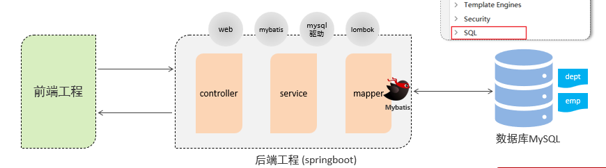
### 开发规范
基于当前最为主流的前后端分离模式进行开发。
- 开发规范-Restful
- REST（REpresentational State Transfer），表述性状态转换，它是一种软件架构风格
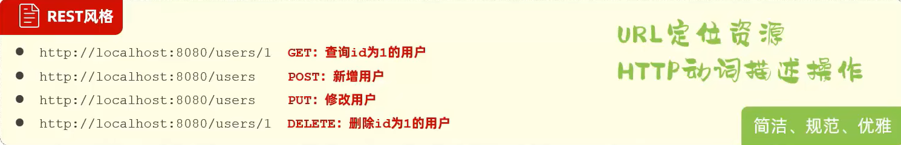

注意事项：
- REST 是风格，是约定方式，约定不是规定，可以打破。
- 描述模块的功能通常使用复数，也就是加s的格式来描述，表示此类资源，而非单个资源。如：users、emps、books…

开发流程：

## 部门管理
### 查询部门
```java
@Slf4j //添加控制台输出注解 
log.info("查询全部部门数据");
// @RequestMapping(value = "/depts", method = RequestMethod.GET)
@GetMapping("/depts") // 等效注解
```
### 删除部门
```java
@DeleteMapping
@PathVariable // 接收请求参数 id
```
### 新增部门
```java
@PostMapping
@RequestBody // 将得到的 json 字符串封装为对象
```
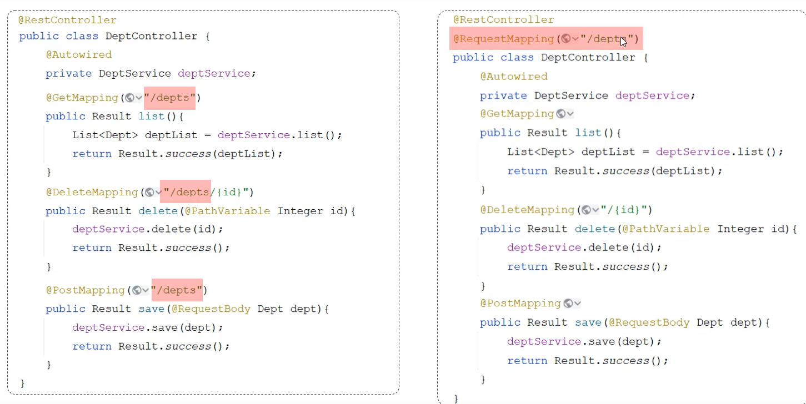

注意事项：
- 一个完整的请求路径，应该是类上的 `@RequestMapping` 的 value 属性 + 方法上的 `@RequestMapping` 的 `value` 属性。

## 员工管理
### 分页查询
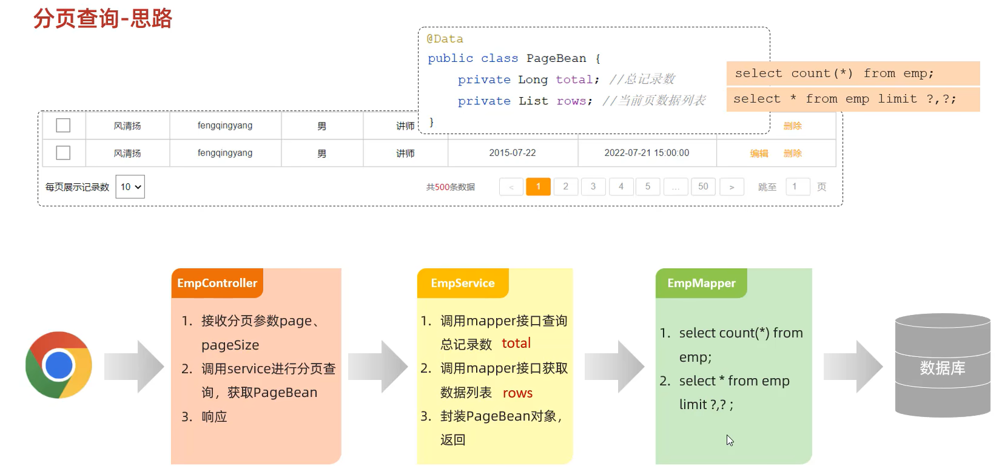
```java
public Result page(@RequestParam(defaultValue = "1") Integer page, Integer pageSize)

@RequestParam //给参数设置默认值
```
1. 分页查询
    - 请求参数：页码、每页展示记录数
    - 响应结果：总记录数、结果列表  (PageBean)
2. 注解： `@RequestParam(defaultValue="1") //设置请求参数默认值`
3. PageHelper 分页插件
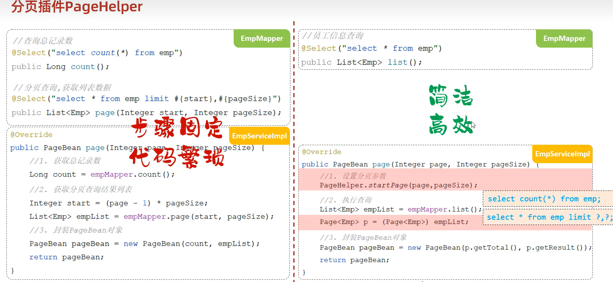
    - 配置依赖
    ```xml
    <dependency>
        <groupId>com.github.pagehelper</groupId>
        <artifactId>pagehelper-spring-boot-starter</artifactId>
        <version>1.4.2</version>
    </dependency> 
    ```
    - 引入依赖：`pagehelper-spring-boot-starter`
    - 使用:
    ```java
    PageHelper.startPage(pageNum, pageSize);
    List<Emp> list = empMapper.list();
    Page<Emp> page = (Page<Emp>)list;
    ```
### 条件分页查询
- 条件查询：动态SQL – XML映射文件
- 分页查询：PageHelper分页插件
- 时间模式设置 `@DateTimeFormat(pattern = "yyyy-MM-dd")`
### 删除员工
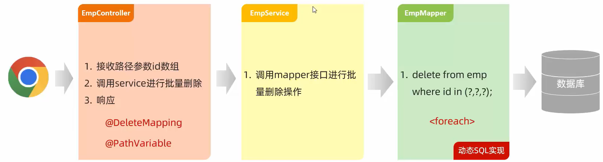

<div align=center>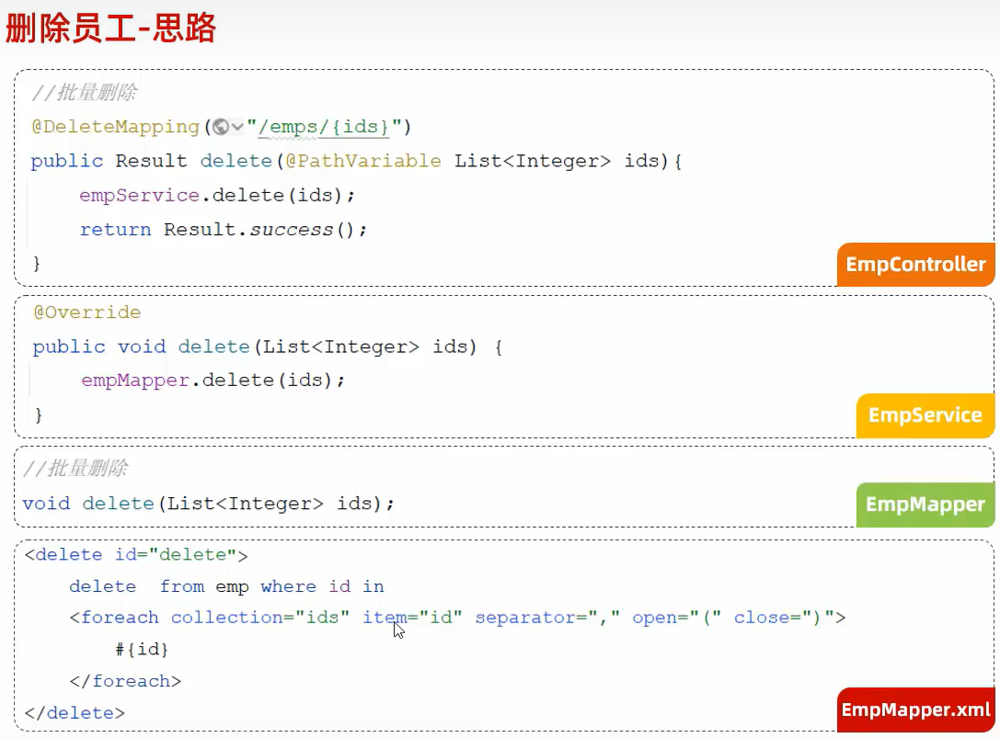</div>


## 文件上传
### 简介
文件上传，是指将本地图片、视频、音频等文件上传到服务器，供其他用户浏览或下载的过程。

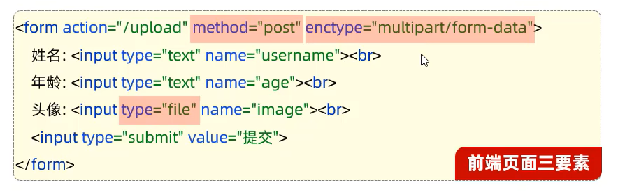
- 服务端接收文件： `MultipartFile`
### 本地存储
在服务端，接收到上传上来的文件之后，将文件存储在本地服务器磁盘中。
```java
@RestController
public class UploadController {
    @PostMapping("/upload")
    public Result upload(MultipartFile image) throws IOException {
        //获取原始文件名
        String originalFilename = image.getOriginalFilename();
        //构建新的文件名
        String newFileName = UUID.randomUUID().toString()+originalFilename.substring(originalFilename.lastIndexOf("."));
        //将文件保存在服务器端 E:/images/ 目录下
        image.transferTo(new File("E:/images/"+newFileName));
        return Result.success();
    }

    String getOriginalFilename(); //获取原始文件名
    void transferTo(File dest); //将接收的文件转存到磁盘文件中
    long getSize(); //获取文件的大小，单位：字节
    byte[] getBytes(); //获取文件内容的字节数组
    InputStream getInputStream(); //获取接收到的文件内容的输入流
}
```
- 在 SpringBoot 中，文件上传，默认单个文件允许最大大小为  1M 。如果需要上传大文件，可以进行如下配置：
```properties
#配置单个文件最大上传大小
spring.servlet.multipart.max-file-size=10MB
#配置单个请求最大上传大小(一次请求可以上传多个文件)
spring.servlet.multipart.max-request-size=100MB
```
### 阿里云OSS
1. 阿里云对象存储 OSS（Object Storage Service），是一款海量、安全、低成本、高可靠的云存储服务。使用 OSS，您可以通过网络随时存储和调用包括文本、图片、音频和视频等在内的各种文件。
2. SDK：Software Development Kit 的缩写，软件开发工具包，包括辅助软件开发的依赖（ jar 包）、代码示例等，都可以叫做 SDK 。
3. Bucket：存储空间是用户用于存储对象（ Object，就是文件）的容器，所有的对象都必须隶属于某个存储空间。
4. 阿里云OSS - 使用步骤

5. 阿里云OSS-集成:
    - 引入阿里云OSS上传文件工具类（由官方的示例代码改造而来）
    - 上传图片接口开发
    ```java
    @RestController
    public class UploadController {
    @Autowired
    private AliOSSUtils aliOSSUtils;
    @PostMapping(“/upload”)
    public Result upload(MultipartFile image) throws IOException {
        String url = aliOSSUtils.upload(image); //调用阿里云OSS工具类，将上传上来的文件存入阿里云
	return Result.success(url); //将图片上传完成后的url返回，用于浏览器回显展示
    }
    }
    ```
### 修改员工
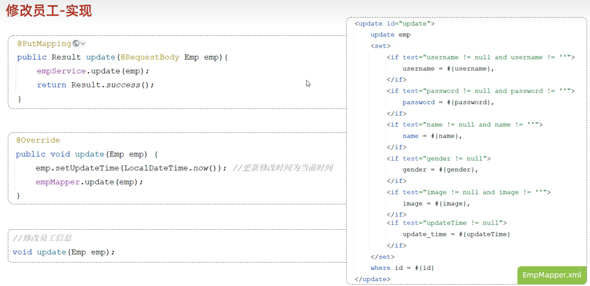
## 配置文件
### 参数配置化
- @Value 注解通常用于外部配置的属性注入，具体用法为： @Value("${配置文件中的key}")
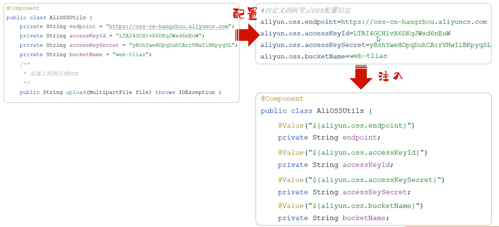
### yml 配置文件
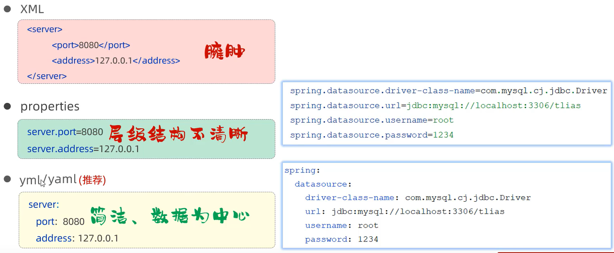

基本语法：
- 大小写敏感
- 数值前边必须有空格，作为分隔符
- 使用缩进表示层级关系，缩进时，不允许使用Tab键，只能用空格（idea中会自动将Tab转换为空格）
- 缩进的空格数目不重要，只要相同层级的元素左侧对齐即可
- \# 表示注释，从这个字符一直到行尾，都会被解析器忽略

<div align=left>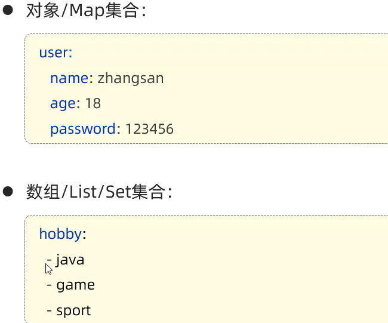</div>

### @ConfigurationProperties
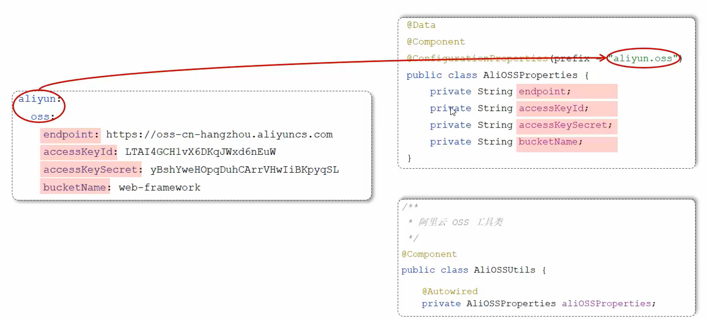

添加依赖：
```xml
<!-- 可选 -->
<dependency>
  <groupId>org.springframework.boot</groupId>
  <artifactId>spring-boot-configuration-processor</artifactId>
</dependency>
```

@ConfigurationProperties 与 @Value
- 相同点：都是用来注入外部配置的属性的。
- 不同点：
    - `@Value` 注解只能一个一个的进行外部属性的注入。
    - `@ConfigurationProperties` 可以批量的将外部的属性配置注入到 bean 对象的属性中。